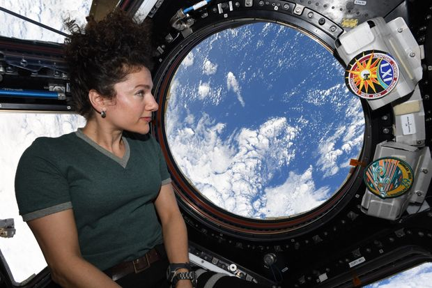

# Website and Library to Predict Satellite Overpasses

I've been developing a Python/C library to accompany a website that will show upcoming overpasses for any satellite over a user-defined location on earth.

I found that existing websites that provide this function aren't user friendly and have poor performance.

Here is an image from this directory:



And an image from the static root

